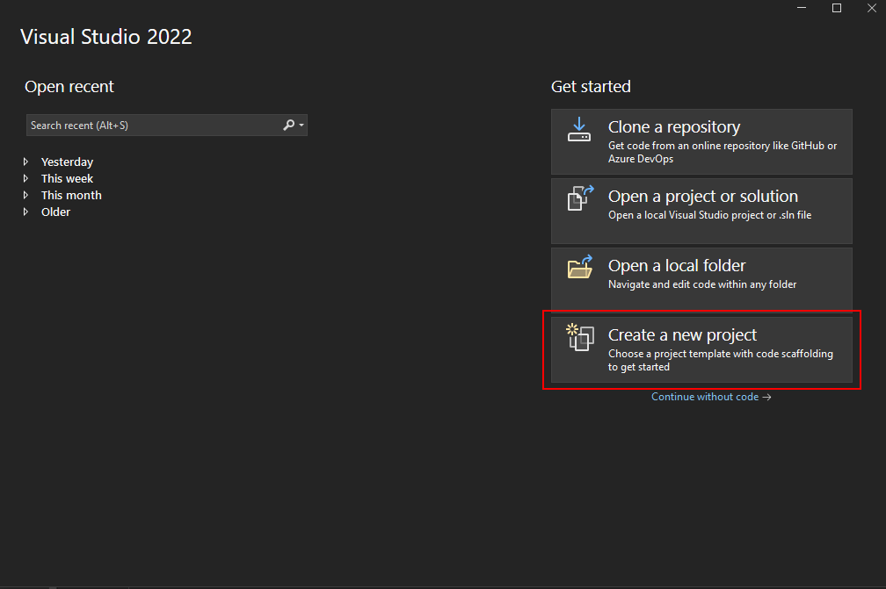
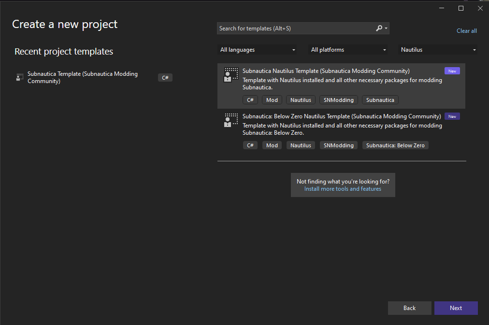
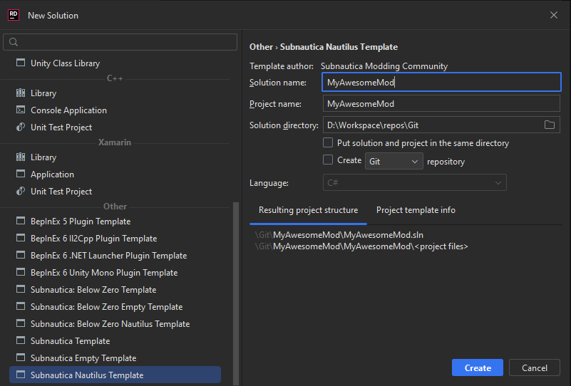
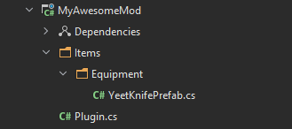
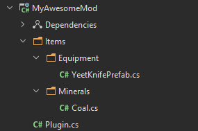
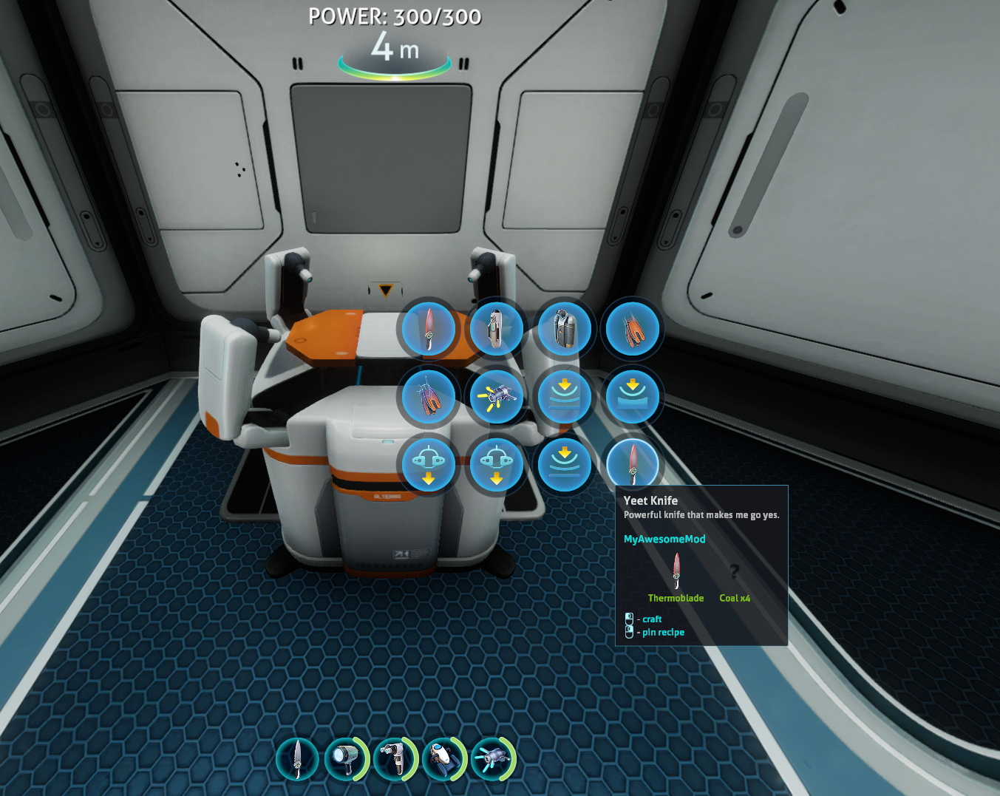

# Simple Mod Guide

In this guide we will make a new knife using Nautilus that knock-backs enemies on-hit. Additionally, we will also create a new mineral and add it
to our knife's recipe.  

Firstly, we will need to setup a development environment. If you haven't already, check out our [Development setup guide](dev-setup.md).  

Now that we have a development environment, we can create a project using the [Subnautica Templates](dev-setup.md#installing-subnautica-modding-templates).

# [Visual Studio 2022](#tab/vs)
1. Open Visual Studio
2. Click on "Create new project"  

3. Search for "Nautilus", click on "Subnautica Nautilus Template" or "Subnautica: Below Zero Nautilus Template" depending on the game you're trying to mod then hit next

4. Choose a name for your project, then create the project

# [JetBrains Rider](#tab/rider)
1. Open JetBrains Rider
2. Click on "New solution"
3. At the left section choose "Subnautica Nautilus Template" or "Subnautica: Below Zero Nautilus Template" depending on the game you're trying to mod
4. Pick a name for your project, then create the project


# [.NET CLI](#tab/cli)
1. Open a terminal
2. Create a folder for where your project will be stored
```powershell
mkdir YourProjectName
```
3. Navigate to the new folder using `cd YourProjectName`
4. Create the project  
Subnautica:
```powershell
dotnet new snmod_nautilus
```
Subnautica Below Zero:
```powershell
dotnet new bzmod_nautilus
```

---

The new project should contain the following structure:
```bash
MyAwesomeMod/Items/Equipment/YeetKnifePrefab.cs
MyAwesomeMod/Plugin.cs
```


This template contains the code of a functional knife that knock-backs enemies on strike. This knife can be found in the Modification station.
Now that we have the code for the knife, we will make our new custom mineral.

Begin by creating a new directory under `MyAwesomeMod/Items/` and name it `Minerals`. Create a new C# file by right clicking on the `Minerals` folder and call it `Coal.cs`.
The project structure now should look like this:  


Our Coal mineral will be using the same model as the Nickel Ore. The Coal.cs file should end up looking something like this:
```csharp
public class Coal
{
    // To access the TechType anywhere in the project
    public static PrefabInfo Info { get; private set; }

    public static void Register()
    {
        Info = PrefabInfo.WithTechType("Coal", "Coal", "Coal that makes me go yes.");
        var coalPrefab = new CustomPrefab(Info);

        // The model of our coal will use the same one as Nickel's.
        var coalObj = new CloneTemplate(Info, TechType.Nickel);
        coalPrefab.SetGameObject(coalObj);
        
        // register the coal to the game
        coalPrefab.Register();
    }
}
```

Now we need to register this new Coal object into the game. To do that, open the Plugin.cs file and edit it to call the `Coal.Register()` method
```csharp
// Plugin.cs

private void InitializePrefabs()
{
    Coal.Register();
    YeetKnifePrefab.Register();
}
```

At this point, our Coal mineral is successfully added to the game. To add it as a recipe to our Yeet Knife, all we'll need to do is to edit the `SetRecipe` method
of the `YeetKnifePrefab` object.
```csharp
// YeetKnifePrefab.cs
...

public static void Register()
{
    var customPrefab = new CustomPrefab(Info);

    var yeetKnifeObj = new CloneTemplate(Info, TechType.HeatBlade);
    yeetKnifeObj.ModifyPrefab += obj =>
    {
        var heatBlade = obj.GetComponent<HeatBlade>();
        var yeetKnife = obj.AddComponent<YeetKnife>().CopyComponent(heatBlade);
        Object.DestroyImmediate(heatBlade);
        yeetKnife.damage *= 2f;
    };
    customPrefab.SetGameObject(yeetKnifeObj);
    
    // Recipe requires 1 Heat blade and 4 Coal.
    var recipe = new RecipeData(new Ingredient(TechType.HeatBlade), new Ingredient(Coal.Info.TechType, 4));
        customPrefab.SetRecipe(recipe)
            .WithFabricatorType(CraftTree.Type.Workbench);
    customPrefab.SetEquipment(EquipmentType.Hand);
    customPrefab.Register();
}
```

Now we can build the project, then put the compiled .dll file into `Subnautica/BepInEx/plugins/` and launch the game to run our mod.


As can be seen, the Coal does not have an icon and uses the default "?" sprite. To set an icon, we can simply call the `WithIcon` method on our PrefabInfo object.  
```csharp
// Coal.cs

public static void Register()
{
    // Uses the Nickel Ore icon for the Coal item.
    Info = PrefabInfo.WithTechType("Coal", "Coal", "Coal that makes me go yes.").WithIcon(SpriteManager.Get(TechType.Nickel));
    var coalPrefab = new CustomPrefab(Info);

    // The model of our coal will use the same one as Nickel's.
    var coalObj = new CloneTemplate(Info, TechType.Nickel);
    coalPrefab.SetGameObject(coalObj);
    
    // register the coal to the game
    coalPrefab.Register();
}
```

You can also set the icon to a .png file by using the [ImageUtils](xref:Nautilus.Utility.ImageUtils) class.

This reaches the end of this guide. Please check out our [Tutorials](../tutorials/overview.md) section to learn more about this library.  
For more examples, check out our [Example mod](https://github.com/SubnauticaModding/Nautilus/tree/master/Example%20mod).